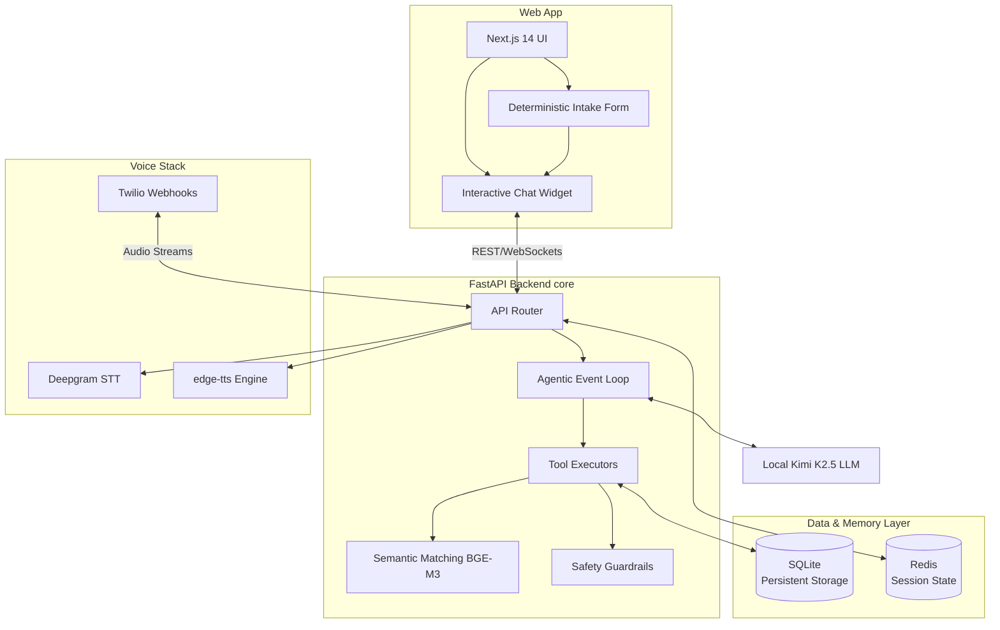

# Kyron Care — AI-Powered Patient Scheduling Assistant

**A production-quality, fully autonomous patient scheduling system for Kyron Medical Group, featuring both interactive Web Chat and a real-time Voice telephony pipeline.** 

This project is a detailed take-home challenge submission, showcasing an end-to-end intelligent AI agent capable of understanding real-time conversational context, persistent long-term patient memory, semantic practitioner matching, and dynamic voice synthesis—all while leveraging a cost-effective, open-source-first architecture.

## 🏗️ System Architecture



## 🌟 Key Features & Architectural Highlights

### 1. Deterministic Patient Intake Pipeline
To ensure a secure, zero-trust verification flow and reduce unnecessary API/LLM calls, the patient data collection flow is explicitly deterministic:
- Users fill out a secure Next.js form on the frontend to verify their identity before reaching the LLM agent.
- This eliminates hallucinated data collection loops and strictly bounds the AI to verified patient profiles, drastically improving backend reliability.

### 2. Cost-Effective "Free Voice" Pipeline
To achieve a highly scalable, zero-to-low-cost audio pipeline, we shifted away from expensive, paid conversational layers (like OpenAI Realtime API) to a custom-built, highly optimized stack:
- **Speech-to-Text (STT)**: **Deepgram** to rapidly convert telephony audio to text.
- **Intelligence (LLM)**: **Ollama** running **Kimi K2.5** locally, ensuring zero API token costs per inference.
- **Text-to-Speech (TTS)**: **edge-tts** for completely free, low-latency voice generation.
- **Telephony**: **Twilio** webhooks integrated directly into the FastAPI backend.

### 3. Persistent Agentic Memory & Storage
Rather than relying on hidden, static lookups, the agent is a first-class autonomous entity paired with highly durable storage:
- **SQLite Persistence**: Migrated from ephemeral Redis data storage to a robust SQLite database for permanent patient and appointment storage across server restarts.
- **`search_patient_history` Tool**: The AI autonomously queries the SQLite DB to recall past appointments, ongoing treatments, or prior physician preferences seamlessly in real time. Returning patients receive a highly personalized, context-aware experience.

### 4. Intelligent RAG & Semantic Doctor Matching
- Uses **BGE-M3** (BAAI) via `sentence-transformers` for deep semantic embeddings.
- Semantically aligns patient symptom descriptions (e.g., "my knee hurts when running") with the correct specialist's expertise and schedule via `matcher.py`.

### 5. Enterprise Guardrails
- **Backend Guardrails**: Integrated safety checks (`guardrails.py`) strictly enforce scheduling constraints, blocking hallucinations of fake appointments or unsafe medical advice.

---

## 🛠️ Tech Stack Summary

| Layer | Technology |
|---|---|
| **Frontend** | Next.js 14, React, TypeScript |
| **Backend API** | Python, FastAPI, `uv` package manager |
| **Local LLM** | Ollama, Kimi K2.5 (`hf.co/bartowski/Kimi-K2-Instruct-GGUF:Q4_K_M`) |
| **Voice Stack** | Twilio (Routing), Deepgram (STT), `edge-tts` (TTS), `pydub`/`ffmpeg` |
| **Data & Auth** | SQLite (Persistence), Redis (Session State) |
| **Embeddings** | `sentence-transformers`, BGE-M3 (BAAI) |
| **Infrastructure**| Nginx, AWS EC2, Let's Encrypt |

---

## 💻 Local Development Setup

### Prerequisites
- Python 3.11+, Node.js 18+, Redis, `uv` package manager, and `Ollama`.
- Ensure `ffmpeg` is installed for audio stream processing:
  - **Windows**: `winget install ffmpeg` 
  - **Mac**: `brew install ffmpeg`
  - **Ubuntu**: `sudo apt install -y ffmpeg`

### 1. Clone & Configure
```bash
git clone https://github.com/Agastya910/kyronmedical.git
cd kyronmedical
```

### 2. Backend Initialization
The backend relies on `uv` for lightning-fast dependency resolution.
```bash
cd backend
cp .env.example .env 
```
**API Keys setup in `.env`**:
- **Deepgram API Key** (Free Tier: `DEEPGRAM_API_KEY`)
- **Twilio Credentials** (`TWILIO_ACCOUNT_SID`, `TWILIO_AUTH_TOKEN`, `TWILIO_PHONE_NUMBER`)
- **Ngrok Base URL** (for local Twilio webhook testing: `SERVER_BASE_URL=https://<your-ngrok-url>`)

```bash
uv sync
uv run uvicorn main:app --reload --port 8000
```

### 3. Local LLM Setup (Ollama)
Pull the Kimi K2.5 Instruct model for the local LLM agent to begin local inferencing.
```bash
ollama pull hf.co/bartowski/Kimi-K2-Instruct-GGUF:Q4_K_M
ollama serve
```

### 4. Frontend Initialization
```bash
cd ../frontend
cp .env.example .env.local
npm install
npm run dev
```
The full application will now be running at [http://localhost:3000](http://localhost:3000).

---

## 📞 Testing the Voice Pipeline
1. Boot up `ngrok`: `ngrok http 8000`
2. Update your `.env` with the `SERVER_BASE_URL` from ngrok.
3. Configure your Twilio Phone Number's **"A call comes in"** webhook to point to:
   `https://<your-ngrok-url>/api/webhook/twilio` (HTTP POST).
4. Call the Twilio number. The system will answer, Deepgram will transcribe the audio natively, Ollama will process intent, and `edge-tts` will dynamically synthesize the agent's response over the phone in real time.

---
*Built as a functional prototype demonstrating cost-efficient Local AI architectures, real-time voice synthesis, and explicit tool-calling memory design for medical applications.*
